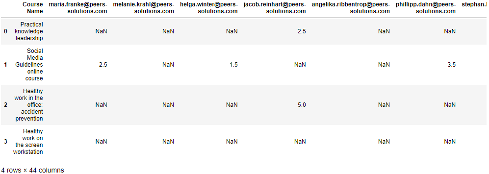
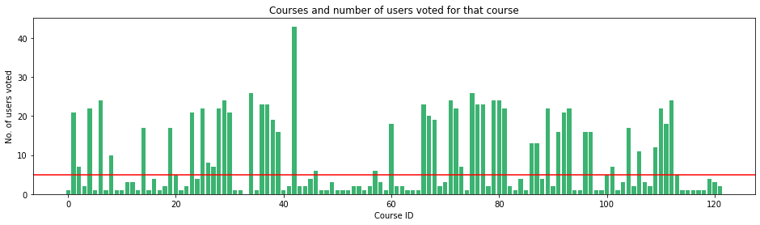

# Building a Course Recommendation System using Python

<link rel="stylesheet" href="https://maxcdn.bootstrapcdn.com/bootstrap/3.3.7/css/bootstrap.min.css" integrity="sha384-BVYiiSIFeK1dGmJRAkycuHAHRg32OmUcww7on3RYdg4Va+PmSTsz/K68vbdEjh4u" crossorigin="anonymous">

    <h2 style="font-family:verdana;color:black;">Problem Statement</h2>
    

        <strong> You are given a dataset of users and their rating against few learning units. Taking this dataset into account, you need to design a recommendation system that would suggest the leanring units for the new users (not have any previous records).</strong>
    

    
<strong> Further Details </strong> 

    
        <ol>
          <li>Learning Unit matrix containing the user's feedback on various Learning Units.</li>
            <ol type="a">
              <li>Here each column represents the rating a user has given for a learning unit</li>
              <li>User identifier is email id</li>
              <li>You will see NA when a user has not rated a learning unit.</li>
            </ol>
          <li>User profile matrix that contains the information about some existing users</li>
          <li>User profile details of some future users for whom you want to recommend Learning Units.</li>
        </ol> 
   
<strong> Challenge </strong>

    Analyze the above dataset (sheet #1 & #2) and design a Recommender system which will recommend 5 LUs (ranked) for each of the future user listed in the Sheet number 3. 

 <strong> There are two approaches that we thought to utilize to solve this problem.</strong> 
### Collaborative Filtering vs. Content Filtering
If an recommendation system suggests items to a user based on past interactions between users and items, that system is known as a Collaborative Filtering system. In these recommendation engines, a user-item interactions matrix is created such that every user and item pair has a space in the matrix (shown in below image). That space is either filled with the user's rating of that item or it is left blank. This can be used for matrix factorization or nearest neighbor classification, we have used KNN to address this problem. The important thing to remember with collaborative filtering is that user id, item id, and rating are the only fields required. Collaborative models can be user-based or item-based.

Content filtering, on the other hand, focuses exclusively on either the item or the user and does not need any information about interactions between the two. Instead, content filtering calculates the similarity between items or users using attributes of the items or users themselves.
    
 <strong> We used collaborative filtering to address this problem.</strong> 

## Dataset
The intersection of row and column shows the rating of the leanring unit given by that user (see the above image). For example user-1 has given 2.5 rating for the course-2. The Nan values are representing that the rating has not given by that user for that particular leanring unit. We replaced the Nan values by 0. 
    
We further tried to analyse, how the user voted for each course and their vote frequency. We can put the threhold to minimize the number of users (for example, we can consider only those users who have voted at least 8 times and the similarly minimize the number of courses by defining the constraint over the minimum rating for the course. The read line in the graphs represents these thresholds.

## Conclusions
### Collaborative Filtering
I created 2 user-based Collaborative Filtering RS via PySpark and Surprise. PySpark, while slower, had a much better RMSE rate and would thus be my preferred model if I wanted to recommend books by user. PearsonR was the only item-based Collaborative Filtering RS that I built but I was satisfied with the results. If I were to continue with this project, I would further investigate item-based models and look for an alternative method of evaluation.

### Content Filtering
This portion of the project was most interesting to me because it allowed me to conduct text analysis. Looking at the results of my models, I believe that the tfidf model is most relevant but, as I indicated above, that is a matter of personal preference. It might be interesting to do additional research on the review text for each book, even conducting sentiment analysis to determine what percentage of reviews are positive vs. negative. My interaction with the data led me to believe that most people write positive reviews, but it could be helpful to identify the negative reviews and use those to negatively weight the books for recommendations. I could also conduct a live survey for users to try out the content filtering models and rate them, allowing me to better measure their success. One final thought for future investigation involves image classification. Goodreads provides a url to show the cover of most of its books, so it could be interesting to see if a model could be trained on the images to predict genre or even recommend titles.

In all, I felt like this was a good choice for a practicum project. The problem was interesting to me and also advanced enough to challenge me to learn more about text analysis and machine learning algorithms used in recommendation engines. The data did involve some cleaning and prep, especially since I had to change datasets in Week 3, but it was not so time consuming that I did not get to spend adequate time on building and tuning the models. I was also able to improve my Python skills and learned how to use several packages that were new to me (Surprise, pandas_profiling, PySpark - I had limited experience).

## References:
* https://heartbeat.fritz.ai/recommender-systems-with-python-part-i-content-based-filtering-5df4940bd831
* https://github.com/ArmandDS/jobs_recommendations/blob/master/job_analysis_content_recommendation.ipynb
* https://github.com/MengtingWan/goodreads
* https://github.com/NicolasHug/Surprise/blob/master/examples/top_n_recommendations.py
* https://github.com/nikitaa30/Content-based-Recommender-System/blob/master/recommender_system.py
* https://github.com/susanli2016/Machine-Learning-with-Python/blob/master/Recommender%20Systems%20-%20The%20Fundamentals.ipynb
* https://medium.com/@armandj.olivares/building-nlp-content-based-recommender-systems-b104a709c042
* https://medium.com/@chhavi.saluja1401/recommendation-systems-made-simple-b5a79cac8862
* https://stackabuse.com/creating-a-simple-recommender-system-in-python-using-pandas/
* https://stackoverflow.com/questions/39303912/tfidfvectorizer-in-scikit-learn-valueerror-np-nan-is-an-invalid-document
* https://towardsdatascience.com/collaborative-filtering-based-recommendation-systems-exemplified-ecbffe1c20b1
* https://towardsdatascience.com/how-did-we-build-book-recommender-systems-in-an-hour-the-fundamentals-dfee054f978e
* https://towardsdatascience.com/introduction-to-recommender-systems-6c66cf15ada
* https://towardsdatascience.com/my-journey-to-building-book-recommendation-system-5ec959c41847
* https://towardsdatascience.com/recommendation-systems-models-and-evaluation-84944a84fb8e
* https://towardsdatascience.com/various-implementations-of-collaborative-filtering-100385c6dfe0
* https://www.kaggle.com/robottums/hybrid-recommender-systems-with-surprise
* https://www.kaggle.com/vchulski/tutorial-collaborative-filtering-with-pyspark
* https://www.tutorialspoint.com/change-data-type-for-one-or-more-columns-in-pandas-dataframe-1
* Han, J., Pei, J., & Kamber, M. (2011). Data mining: concepts and techniques. Elsevier.
