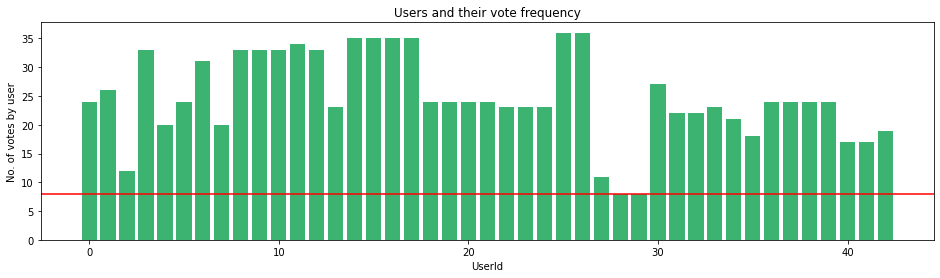

# Building a Course Recommendation System using Python

<link rel="stylesheet" href="https://maxcdn.bootstrapcdn.com/bootstrap/3.3.7/css/bootstrap.min.css" integrity="sha384-BVYiiSIFeK1dGmJRAkycuHAHRg32OmUcww7on3RYdg4Va+PmSTsz/K68vbdEjh4u" crossorigin="anonymous">

    <h2 style="font-family:verdana;color:black;">Problem Statement</h2>
    

        <strong> You are given a dataset of users and their rating against few learning units. Taking this dataset into account, you need to design a recommendation system that would suggest the leanring units for the new users (not have any previous records).</strong>
    

    
<strong> Further Details </strong> 

    
        <ol>
          <li>Learning Unit matrix containing the user's feedback on various Learning Units.</li>
            <ol type="a">
              <li>Here each column represents the rating a user has given for a learning unit</li>
              <li>User identifier is email id</li>
              <li>You will see NA when a user has not rated a learning unit.</li>
            </ol>
          <li>User profile matrix that contains the information about some existing users</li>
          <li>User profile details of some future users for whom you want to recommend Learning Units.</li>
        </ol> 
   
<strong> Challenge </strong>

    Analyze the above dataset (sheet #1 & #2) and design a Recommender system which will recommend 5 LUs (ranked) for each of the future user listed in the Sheet number 3. 

 <strong> There are two approaches that we thought to utilize to solve this problem.</strong> 
### Collaborative Filtering vs. Content Filtering
If an recommendation system suggests items to a user based on past interactions between users and items, that system is known as a Collaborative Filtering system. In these recommendation engines, a user-item interactions matrix is created such that every user and item pair has a space in the matrix (shown in below image). That space is either filled with the user's rating of that item or it is left blank. This can be used for matrix factorization or nearest neighbor classification, we have used KNN to address this problem. The important thing to remember with collaborative filtering is that user id, item id, and rating are the only fields required. Collaborative models can be user-based or item-based.

Content filtering, on the other hand, focuses exclusively on either the item or the user and does not need any information about interactions between the two. Instead, content filtering calculates the similarity between items or users using attributes of the items or users themselves.
    
 <strong> We used collaborative filtering to address this problem.</strong> 

## Dataset
The intersection of row and column shows the rating of the leanring unit given by that user (see the above image). For example user-1 has given 2.5 rating for the course-2. The Nan values are representing that the rating has not given by that user for that particular leanring unit. We replaced the Nan values by 0. 
    
We further tried to analyse, how the user voted for each course and their vote frequency. We can put the threhold to minimize the number of users (for example, we can consider only those users who have voted at least 8 times and the similarly minimize the number of courses by defining the constraint over the minimum rating for the course. The read line in the graphs represents these thresholds.

### Users behaviour
We created a 3D scatter plot to see how user's background is positioned with respect to each other. The red dots are represeting the user in the 3D space, while the number represents the user id. For example user "maria.franke@peers-solutions.com" has user id "1", user "melanie.krahl@peers-solutions.com" has user id "2" and so on.
We can see a overlap on red dots and the numbers, this shows that two users shares the same industry, position and department.
The test users (who are not enrolled in the system) is represented by green square.
For the test users, if they don't fall into the existing industries, positions and departements then we use 0, rather than assigning the respective value.

    
## Results
These recommendations are based on the 5 neighbourhood configuration, we can further change the neighbourhood and see the change in results. Further matrix factorization and other approaches can be utilized to solve this problem. Tensorflow recommendation system is also a good tool for the fast development, they have serveral apis to support for the purpose.
    

<strong><i>** we have changed the course name from german to english to understand the prediction results and also to analyze the data during the modelling process </i></strong>

## Dependencies
We used following packages to create our solution, they can be installed by running the below commands. We used Python version 3.9.7
* pip install pandas
* pip install numpy
* pip install scipy
* pip install sklearn
* pip install matplotlib

## References:
* https://www.tensorflow.org/recommenders
* https://heartbeat.fritz.ai/recommender-systems-with-python-part-i-content-based-filtering-5df4940bd831
* https://github.com/ArmandDS/jobs_recommendations/blob/master/job_analysis_content_recommendation.ipynb
* https://github.com/MengtingWan/goodreads
* https://github.com/NicolasHug/Surprise/blob/master/examples/top_n_recommendations.py
* https://github.com/nikitaa30/Content-based-Recommender-System/blob/master/recommender_system.py
* https://github.com/susanli2016/Machine-Learning-with-Python/blob/master/Recommender%20Systems%20-%20The%20Fundamentals.ipynb
* https://medium.com/@armandj.olivares/building-nlp-content-based-recommender-systems-b104a709c042
* https://medium.com/@chhavi.saluja1401/recommendation-systems-made-simple-b5a79cac8862
* https://stackabuse.com/creating-a-simple-recommender-system-in-python-using-pandas/
* https://stackoverflow.com/questions/39303912/tfidfvectorizer-in-scikit-learn-valueerror-np-nan-is-an-invalid-document
* https://towardsdatascience.com/collaborative-filtering-based-recommendation-systems-exemplified-ecbffe1c20b1
* https://towardsdatascience.com/how-did-we-build-book-recommender-systems-in-an-hour-the-fundamentals-dfee054f978e
* https://towardsdatascience.com/introduction-to-recommender-systems-6c66cf15ada
* https://towardsdatascience.com/my-journey-to-building-book-recommendation-system-5ec959c41847
* https://towardsdatascience.com/recommendation-systems-models-and-evaluation-84944a84fb8e
* https://towardsdatascience.com/various-implementations-of-collaborative-filtering-100385c6dfe0
* https://www.kaggle.com/robottums/hybrid-recommender-systems-with-surprise
* https://www.tutorialspoint.com/change-data-type-for-one-or-more-columns-in-pandas-dataframe-1
* Han, J., Pei, J., & Kamber, M. (2011). Data mining: concepts and techniques. Elsevier.
